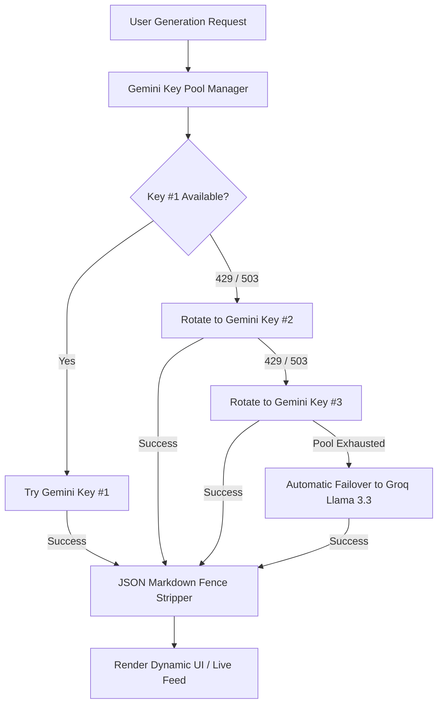
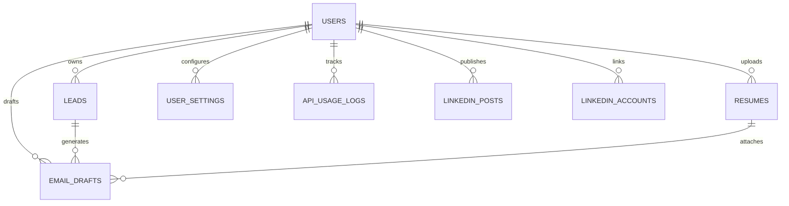

# 🚀 ReachOut AI — Autonomous AI Agent Launch Radar & Career Outreach Platform

<p align="center">
  
</p>

<p align="center">
  <a href="https://mail-sent-agent.onrender.com/" target="_blank">
    
  </a>
  <a href="https://github.com/yuvamk/Mail-sent-agent-"></a>
  <a href="https://nextjs.org"></a>
  <a href="https://supabase.com"></a>
  <a href="https://deepmind.google/technologies/gemini/"></a>
  <a href="https://groq.com"></a>
  <a href="https://linkedin.com"></a>
  <a href="https://brevo.com"></a>
</p>

<p align="center">
  🚀 <b>Live Production App:</b> <a href="https://mail-sent-agent.onrender.com/"><b>https://mail-sent-agent.onrender.com/</b></a>
</p>

---

## 📸 Platform Overview

<p align="center">
  
</p>

<p align="center"><i>The Multi-Engine Ecosystem: Autonomous GitHub Launch Radar, AI LinkedIn Auto-Publisher, and High-Volume Cold Outreach.</i></p>

---

## ⚡ What We Built: Core Pillars & Capabilities

```mermaid
graph TD
    subgraph "1. Autonomous GitHub Launch Radar"
        A[GitHub Search API: created:>recent] --> B[Duplicate Shield: Filter Already Posted]
        B --> C[LLM Principal Tech Evaluator: Gemini 2.0 Flash]
        C --> D[Select #1 Best Builder Tool]
        D --> E{User Mode: ON / OFF}
        E -->|Auto-Draft| F[Save in Studio Drafts + Email Alert]
        E -->|Auto-Post| G[Direct REST API Publish to LinkedIn + Email Alert]
    end

    subgraph "2. Cool AI Agent Repos Engine"
        H[5 Domain Categories] --> I[Age Badges: Launched Today, 7d ago]
        I --> J[Superpowers & Quickstart Commands]
    end

    subgraph "3. High-Volume Cold Outreach"
        K[Schema-Less Excel Ingestion] --> L[Excel Upload Date Filters]
        L --> M[Metric Cards Filter: Sent / Opened]
        M --> N[Global Multi-Column Search]
        N --> O[Custom SMTP Dispatch + IMAP Reply Tracking]
    end

    subgraph "4. Auth & Admin Suite"
        P[Instant Custom SMTP OTP] --> Q[Supabase Session]
        Q --> R[Admin Governance: Permanent Cascading User Deletion]
    end
```



---

### 🤖 Pillar 1: Autonomous AI Agent Launch Radar & Auto-Poster

An autonomous agent that watches GitHub 24/7 for newly published open-source AI agent repositories and announces them on LinkedIn:

* 🚨 **Real-Time Live GitHub Detection**:
  * Automatically scans GitHub Search API for newly created repositories matching `topic:ai-agents` created recently (`sort=created&order=desc`).
  * Calculates exact launch age badges (`🚨 Launched Today!`, `⚡ Launched Yesterday`, `🚀 Launched 7d ago`, `✨ Launched 2w ago`).
* 🧠 **LLM Principal Tech Evaluator (`lib/autonomous-agent.ts`)**:
  * Evaluates candidate repositories on **Practical Developer Utility**, **Ease of Integration**, **Architectural Depth**, and **Community Signal**.
  * Intelligently scores candidates and picks the **#1 standout tool**.
* 🛡️ **Duplicate Avoidance Shield**:
  * Permanently records processed repository URLs in `user_settings.auto_radar_posted_repos` and `linkedin_posts`.
  * Guarantees zero duplicate posts across your entire feed.
* ⚡ **User Control: 100% in Your Hands**:
  * **Default is OFF**: Auto-Pilot will not execute until explicitly enabled by the user.
  * **Mode 1 — 📝 Auto-Draft & Review**: The agent prepares the full post and saves it to your Drafts for one-click review.
  * **Mode 2 — ⚡ Full Auto-Post**: The agent automatically publishes directly to your personal LinkedIn profile via the official REST API (v202608).
  * **On-Demand "Run Auto-Pilot Now" Button**: Run an immediate scan and evaluation cycle without waiting for cron schedules.
  * **AI Decision Log Modal**: Complete transparency showing why the AI selected that repo, its utility score (out of 100), and its killer superpower.
* 🕒 **Scheduled Background Cron Worker (`app/api/cron/radar/route.ts`)**:
  * Fully automatable via Render Cron, GitHub Actions, or cron-job.org:
    ```bash
    curl -X POST "https://your-domain.onrender.com/api/cron/radar" \
         -H "Authorization: Bearer YOUR_CRON_SECRET"
    ```

---

### ⭐ Pillar 2: Cool AI Agent Repos Discovery Engine

A curated and live catalog of open-source AI agent tools that help developers build autonomous software:

* 🗂️ **5 Specialized Domain Categories**:
  1. **Automation & Browsing** (`browser-use`, `firecrawl`, etc.)
  2. **Coding & Dev Tools** (`nanocoder`, `pydantic-ai`, `anything2explainer`, `ECC`, etc.)
  3. **Multi-Agent Frameworks** (`crewAI`, `langgraph`, `reef`, etc.)
  4. **Memory & Context** (`agent-memory`, `magic-context`, `mem0`, etc.)
  5. **Workflow & Productivity** (`eliza`, `goose`, `harnessrouter`, etc.)
* 🚀 **Instant Breakdown Generator**:
  * Generates high-retention LinkedIn posts structured with:
    1. **Hook**: Scroll-stopping problem statement.
    2. **What It Is & What It Does**: Clear, high-signal explanation.
    3. **Superpowers (`⚡`)**: 3-4 concrete capabilities.
    4. **Quickstart Setup**: Direct terminal / pip / npm commands.
    5. **Direct Repository Link**: `⭐ GitHub Repository: https://github.com/...`
    6. **Engagement Prompt & Builder Hashtags**.

---

### 🏛️ Pillar 3: LinkedIn Thought Leadership & News Radar

<p align="center">
  
</p>

* 📡 **Live Tech Radar**: Aggregates breaking stories from TechCrunch AI, VentureBeat, Hacker News, and research papers from ArXiv CS.AI.
* 🎨 **Visual Prompt Studio**: Synthesizes 3 contextual visual prompts with Gemini (Technical Diagram, Conceptual Metaphor, and Minimal Typographic Card).
* 🚀 **Direct 1-Click LinkedIn Publishing (REST API v202608)**:
  * Full OAuth 2.0 flow with `w_member_social` scope.
  * Direct binary byte streaming (`Uint8Array`) to LinkedIn media asset endpoints.
* 🎉 **Celebration Modal**: Immediate preview with live post link and copy button upon publication.

---

### 📬 Pillar 4: High-Volume Cold Outreach Engine & Custom SMTP Relay

<p align="center">
  
</p>

* ⚡ **High-Speed Custom SMTP Engine**:
  * Dispatches platform emails and **instant 6-digit email OTPs** using dedicated SMTP relay.
  * **Zero Supabase OTP delay** — OTPs land in under 2 seconds.
* 📅 **Excel Date Filtering**:
  * Filter leads by the exact date the spreadsheet was uploaded to focus exclusively on recent batches.
* 🔍 **Global Multi-Column Search**:
  * Search instantly across candidates, companies, roles, emails, and custom metadata fields.
* 📊 **Interactive Metric Card Filters**:
  * Click the **"Sent"** card to view only sent emails; click **"Opened"** to view leads who opened your email.
* 📂 **Schema-Less Excel & CSV Ingestion**:
  * Preserves all custom columns into Postgres `raw_data jsonb` and injects them into the AI prompt context.
* 📄 **Deep Resume Parsing (`pdf-parse`)**:
  * Ingests candidate PDF resumes stored in Supabase Storage, extracts technical skills, and matches them to lead requirements.
* 🛡️ **Anti-Spam Sent Protection & 200ms Queue**:
  * Sequential batch dispatch with 200ms debouncing and deduplication on `(user_id, company, email)`.
* 📥 **IMAP Inbound Reply Tracking (`imapflow`)**:
  * Detects recruiter responses and links them directly to the outreach history.

---

### 👑 Pillar 5: Administrative Control & Governance Hub

* 🗑️ **Permanent Cascading User Deletion (`/api/admin/users/delete`)**:
  * Complete administrative control to permanently delete any user.
  * Cascades across all associated tables (`leads`, `resumes`, `email_drafts`, `linkedin_posts`, `linkedin_accounts`, `user_settings`, `api_usage_logs`, `user_subscriptions`) and removes the user from **Supabase Auth (`auth.users`)**.
* 🔑 **Platform & Custom API Key Governance**:
  * Admin controls for user plan tiers, subscription extensions (+30 Days, Grant VIP), and platform key allowances.

---

## 🔄 Resilient Multi-Key AI Pool Architecture

To guarantee 99.9% uptime without interruptions caused by rate limits (`429`) or model spikes (`503`), the platform implements automatic key rotation:



---

## 💰 Token Cost Breakdown in Indian Rupees (₹)

| AI Model | Input Cost (per 1M tokens) | Output Cost (per 1M tokens) | Approx. Cost per Email / Post |
| :--- | :---: | :---: | :---: |
| **Google Gemini 1.5 / 2.0 Flash** | **₹6.25** | **₹25.00** | **~₹0.008** *(Sub-paisa!)* |
| **Groq Cloud (Llama 3.3 70B)** | **₹49.17** | **₹65.83** | **~₹0.040** |
| **Anthropic Claude Haiku 3.5** | **₹66.40** | **₹332.00** | **~₹0.120** |

---

## 🗄️ Database Architecture (Supabase Postgres)

The platform runs on **Supabase** with **Row-Level Security (RLS)** ensuring 100% data isolation between users.



### Table Schema:
* **`leads`**: Company, location, recruiter email, and dynamic `raw_data jsonb`.
* **`resumes`**: File names, parsed text, and Supabase storage paths.
* **`email_drafts`**: Outreach bodies, subject lines, delivery statuses (`drafted`, `reviewed`, `approved`, `sent`, `failed`).
* **`user_settings`**: Personal credentials, SMTP host, candidate portfolio links, auto-radar configuration (`auto_radar_enabled`, `auto_radar_mode`, `auto_radar_posted_repos`, `auto_radar_last_decision`).
* **`linkedin_posts`**: Topic, repository/news source, post content, visual prompts, and `linkedin_post_urn`.
* **`linkedin_accounts`**: User OAuth access tokens, profile headline, person URN, and avatar URL.

---

## 🛠️ Getting Started & Installation

### 1. Clone & Install
```bash
git clone https://github.com/yuvamk/Mail-sent-agent-.git
cd Mail-sent-agent-
npm install
```

### 2. Environment Variables (`.env.local`)
```env
# Supabase Configuration
NEXT_PUBLIC_SUPABASE_URL=https://your-project.supabase.co
NEXT_PUBLIC_SUPABASE_ANON_KEY=your-supabase-anon-key
SUPABASE_SERVICE_ROLE_KEY=your-supabase-service-role-key

# Google Gemini API Keys (3-Key Auto-Rotation Pool)
GEMINI_API_KEY_1=your-gemini-key-1
GEMINI_API_KEY_2=your-gemini-key-2
GEMINI_API_KEY_3=your-gemini-key-3

# Groq Cloud Keys (Failover Pool)
GROQ_API_KEY_1=your-groq-key-1
GROQ_API_KEY_2=your-groq-key-2

# Custom High-Speed SMTP Configuration
SMTP_HOST=smtp-relay.brevo.com
SMTP_PORT=587
SMTP_USER=your-smtp-user
SMTP_PASS=your-smtp-password
SMTP_FROM_EMAIL=your-verified-email@example.com

# Cron Security Secret (Optional for external cron triggers)
CRON_SECRET=your-random-secret-key

# Application URL
NEXT_PUBLIC_APP_URL=http://localhost:3000
```

### 3. Database Migrations
Apply migrations via Supabase SQL Editor:
- `supabase/schema.sql`
- `supabase/migrations/20260913_user_settings_admin.sql`
- `supabase/migrations/20260913_admin_user_controls.sql`
- `supabase/migrations/20260916_auto_radar_settings.sql`

### 4. Run Locally
```bash
npm run dev
# Open http://localhost:3000 in your browser
```

---

## 🤝 Contributing & Author

Developed by **[Yuvam Rajput](https://github.com/yuvamk)**. Contributions, pull requests, and feature ideas are welcome!

⭐ **If you find this repository useful, consider giving it a star on GitHub!**
