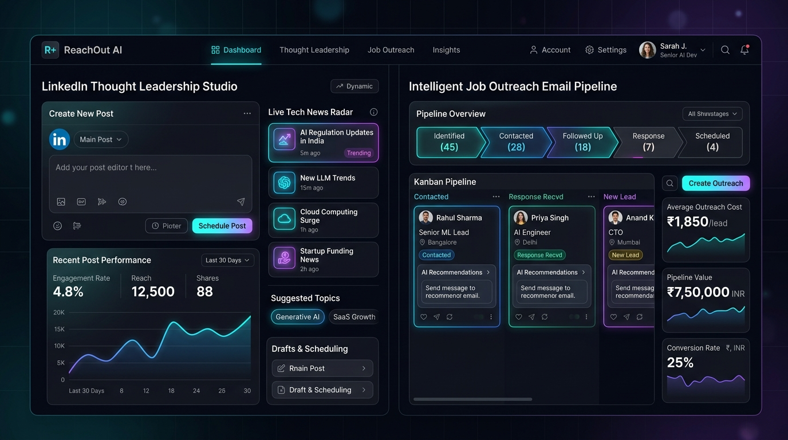
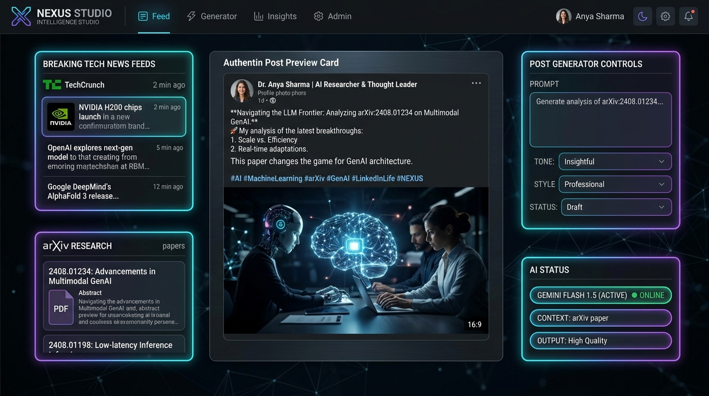
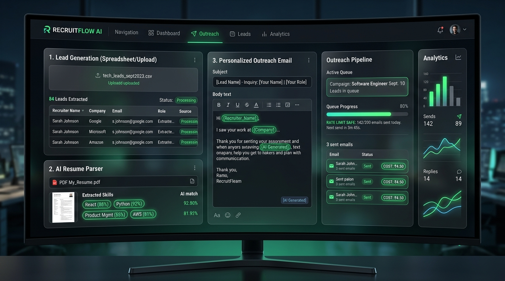
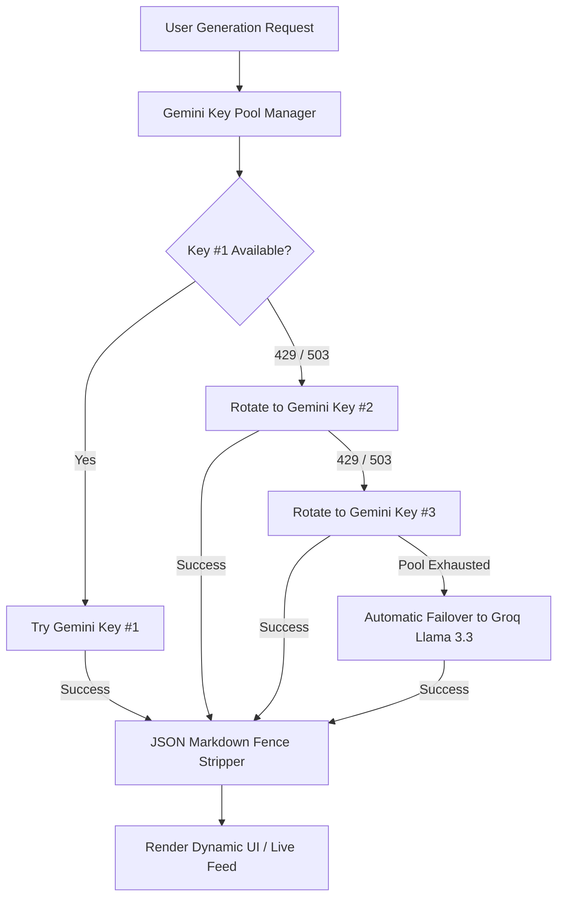
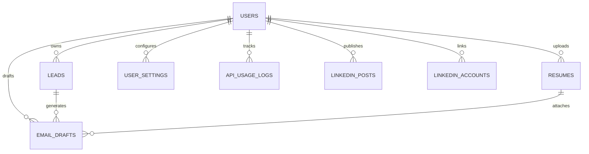

# 🚀 ReachOut AI & LinkedIn Thought Leadership Platform

<p align="center">
  
</p>

<p align="center">
  <a href="https://mail-sent-agent.onrender.com/" target="_blank">
    
  </a>
  <a href="https://github.com/yuvamk/Mail-sent-agent-"></a>
  <a href="https://nextjs.org"></a>
  <a href="https://supabase.com"></a>
  <a href="https://deepmind.google/technologies/gemini/"></a>
  <a href="https://groq.com"></a>
  <a href="https://linkedin.com"></a>
  <a href="https://brevo.com"></a>
</p>

<p align="center">
  🚀 <b>Live Production App:</b> <a href="https://mail-sent-agent.onrender.com/"><b>https://mail-sent-agent.onrender.com/</b></a>
</p>

---

## 📸 Platform Visual Showcase

<p align="center">
  
</p>

<p align="center"><i>The Dual-Engine Dashboard: High-volume Cold Outreach combined with Automated LinkedIn Thought Leadership.</i></p>

---

## ⚡ Overview

**ReachOut AI** is an enterprise-grade, dual-engine career automation platform designed for modern tech professionals and builders. Built with **Next.js 16 (Turbopack)**, **Supabase Postgres (Row-Level Security)**, and **Multi-Key AI Orchestration**, the platform solves two major problems:

1. **LinkedIn Thought Leadership & Daily Presence Engine**: Discovers live breakthrough AI/tech research (TechCrunch, HackerNews, ArXiv), crafts viral insights using **Gemini 1.5 Flash**, prompts aesthetic visuals, and publishes directly to personal LinkedIn profiles with binary image uploads via the official **LinkedIn REST API (v202608)**.
2. **Cold Outreach & Lead Dispatch Pipeline**: Ingests schema-less recruiter spreadsheets (`.xlsx`/`.csv`), parses candidate resumes (`pdf-parse`), tailors contextual pitch emails, queues batch deliveries via **Brevo SMTP** (200ms debounce), tracks delivery status via **Webhooks**, and detects inbound recruiter responses via **IMAP**.

---

## 🌟 Dual-Engine Core Features

### 🏛️ Pillar 1: LinkedIn AI Thought Leadership Studio

<p align="center">
  
</p>

- 📡 **Real-Time Tech Radar**:
  - Automatically fetches live stories from **TechCrunch AI / VentureBeat**, top tech threads from **HackerNews**, and latest research papers from **ArXiv CS.AI**.
  - One-click topic selector with direct source links and publishing timestamps.
- 🧠 **Multi-Tone AI Post Synthesizer**:
  - Switch dynamically between **Thought Leader**, **Technical Deep-Dive**, **Builder / Practical**, and **Provocative / Contrarian**.
  - Powered by **Google Gemini 1.5 Flash** with resilient Groq fallback.
- 📊 **Live Generation HUD & Multi-Stage Progress Bar**:
  - Interactive status bar (0% → 100%) tracking generation stages:
    - `0% - 25%`: *Scanning Live Tech Radar & Sources...*
    - `25% - 60%`: *Synthesizing Analysis with Gemini Flash...*
    - `60% - 85%`: *Crafting Contextual Visual Prompt & Metaphors...*
    - `85% - 100%`: *Rendering 3 Visual Options (Technical / Concept / Minimal)...*
  - Real-time HUD displaying the active model (`gemini-flash-latest`) and active 3-key pool.
- 🎨 **Visual Options & Image Scraper**:
  - Generates 3 contextual visual prompts: **Technical Diagram**, **Conceptual Metaphor**, and **Minimal Typographic Card**.
  - Includes fallback web scraping for original high-resolution news cover images.
- 🚀 **1-Click Direct LinkedIn Publishing (v202608)**:
  - Full OAuth 2.0 integration with `w_member_social` permissions.
  - Multi-step asset upload: `initializeUpload` → direct binary byte streaming (`Uint8Array`) → `rest/posts` publishing.
- 🎉 **Celebratory Success Modal**:
  - Displays immediately upon publishing with emerald confetti glow, author account details, and live status.
  - Direct **`View Live Post on LinkedIn ↗`** button and **`Copy Post Link`** button.

---

### 📬 Pillar 2: High-Volume Cold Outreach Engine

<p align="center">
  
</p>

- 📂 **Schema-Less Excel & CSV Ingestion**:
  - Upload arbitrary recruiter or lead tables. Custom columns are saved into Postgres `raw_data jsonb` and automatically fed into the AI prompt context.
- 📄 **Deep Resume Parsing (`pdf-parse`)**:
  - Ingests candidate PDF resumes stored in Supabase Storage, extracts core technical skills, and matches them to lead requirements.
- 🛡️ **Anti-Spam Sent Email Protection**:
  - Automatic deduplication based on `(user_id, company, email)`. Never pitch the same recruiter twice.
- ⚡ **Zero-Rate-Limit Sequential Batch Queue**:
  - Queues drafts with a 200ms inter-email dispatch delay to protect domain reputation and prevent SMTP throttling.
- 📨 **Brevo SMTP & Webhook Delivery Tracking**:
  - Ingests Brevo webhooks (`/api/webhooks/brevo`) to record delivered, opened, clicked, and bounced events.
- 📥 **Inbound IMAP Reply Tracking (`imapflow`)**:
  - Connects to your email provider via IMAP to detect incoming responses and link replies directly to the outreach history.

---

## 🔄 Resilient Multi-Key AI Pool Architecture

To guarantee 99.9% uptime without interruptions caused by rate limits (`429`) or model spikes (`503`), ReachOut AI implements automatic key rotation and provider fallbacks:



---

## 💰 Token Cost Breakdown in Indian Rupees (₹)

The application provides real-time token tracking and calculates exact costs in Indian Rupees:

| AI Model | Input Cost (per 1M tokens) | Output Cost (per 1M tokens) | Approx. Cost per Email / Post |
| :--- | :---: | :---: | :---: |
| **Google Gemini 1.5 Flash** | **₹6.25** | **₹25.00** | **~₹0.008** *(Sub-paisa!)* |
| **Groq Cloud (Llama 3.3 70B)** | **₹49.17** | **₹65.83** | **~₹0.040** |
| **Anthropic Claude Haiku 4.5** | **₹66.40** | **₹332.00** | **~₹0.120** |

---

## 🗄️ Database Architecture (Supabase Postgres)

The platform runs on **Supabase** with **Row-Level Security (RLS)** ensuring 100% data isolation between users.



### Table Definitions:

- **`leads`**: Stores company, location, recruiter email, and dynamic `raw_data jsonb` from spreadsheets.
- **`resumes`**: Stores file names, extracted text, and Supabase storage paths.
- **`email_drafts`**: Stores generated outreach bodies, subject lines, delivery statuses (`drafted` / `reviewed` / `approved` / `sent` / `failed`), and error logs.
- **`user_settings`**: Per-user dynamic credentials, SMTP host, candidate portfolio links, and custom system prompt presets.
- **`api_usage_logs`**: Token counts and estimated spend in INR (₹) per draft.
- **`linkedin_posts`**: Stores topic, live research source, synthesized post content, visual prompts, and `linkedin_post_urn`.
- **`linkedin_accounts`**: Stores user OAuth access tokens, profile headline, person URN, and avatar URL.

---

## 🛠️ Getting Started & Installation

### 1. Prerequisites
- **Node.js**: v20.x or higher
- **Supabase Account**: Free project on [supabase.com](https://supabase.com)
- **LinkedIn Developer App**: Configured with `w_member_social` and `openid` permissions

### 2. Clone the Repository
```bash
git clone https://github.com/yuvamk/Mail-sent-agent-.git
cd Mail-sent-agent-
npm install
```

### 3. Environment Variables
Create a `.env.local` file in the project root:

```env
# Supabase Configuration
NEXT_PUBLIC_SUPABASE_URL=https://your-project.supabase.co
NEXT_PUBLIC_SUPABASE_ANON_KEY=your-supabase-anon-key
SUPABASE_SERVICE_ROLE_KEY=your-supabase-service-role-key

# Google Gemini API Keys (3-Key Auto-Rotation Pool)
GEMINI_API_KEY_1=your-gemini-key-1
GEMINI_API_KEY_2=your-gemini-key-2
GEMINI_API_KEY_3=your-gemini-key-3

# Groq Cloud Keys (Failover Pool)
GROQ_API_KEY_1=your-groq-key-1
GROQ_API_KEY_2=your-groq-key-2

# Brevo SMTP Configuration (Optional server default)
SMTP_HOST=smtp-relay.brevo.com
SMTP_PORT=587
SMTP_USER=your-smtp-user
SMTP_PASS=your-smtp-key
SMTP_FROM_EMAIL=your-verified-email@example.com

# LinkedIn Credentials (Optional server default)
LINKEDIN_ACCESS_TOKEN=your-access-token
LINKEDIN_PERSON_URN=urn:li:person:your-urn

# Application URL
NEXT_PUBLIC_APP_URL=http://localhost:3000
```

### 💳 Pillar 3: Razorpay Subscription & Billing Engine
- 💰 **Tiered INR Pricing Architecture**:
  - **Pro Career Monthly**: ₹499/month — Unlimited CSV/Excel uploads, Gemini 3-key pool, Groq failover, LinkedIn Studio, Brevo SMTP.
  - **Pro Career Annual**: ₹4,999/year (Save 17%) — All Pro features + priority rate-limit queue + VIP support.
  - **Enterprise Agency**: ₹1,499/month — Multi-account recruiter pooling, white-label domain, full admin governance.
- ⚡ **Automated Pipeline Lockouts**:
  - Automatically asserts active subscription status before generating drafts, dispatching emails, generating LinkedIn posts, or publishing.
  - Expired accounts receive HTTP 402 with seamless in-app upgrade modals.
  - Pre-expiry warning banners activate when $\le 3$ days remain on the subscription.
- 🧾 **Transactional Tax Invoices & Admin Real-Time Alerts**:
  - Automatically dispatches itemized, branded HTML Tax Invoices & Receipts via Brevo SMTP immediately upon successful Razorpay payment verification.
  - Instant admin payment alert notification sent directly to `yuvamk6@gmail.com` with user ID, plan name, order ID, and transaction amount.
- 🛡️ **Admin Governance Hub**:
  - Superadmin (`yuvamk6@gmail.com`) dashboard with one-click actions (+30 Days, Activate, Expire, Grant VIP Lifetime).
  - Immunity for superadmin from service lockouts and subscription expiration.

### 🔐 Pillar 4: Dual Authentication Flow (Email OTP + Password)
- 📬 **Passwordless 6-Digit Email OTP**:
  - Secure verification codes generated server-side and dispatched instantly via Brevo SMTP relay.
  - Verified against Supabase Auth with zero password friction.
- 🔑 **Standard Password Login & Onboarding**:
  - Traditional email + password authentication for returning power users.
  - Interactive candidate profile onboarding collecting signature name, phone, GitHub, and LinkedIn profile URLs.

---

### 4. Supabase MCP & Database Migration
Set up Supabase MCP and execute the database migration:

```bash
# Install Supabase Agent Skills
npx skills add supabase/agent-skills
```

Apply the SQL schema in `supabase/schema.sql`, `supabase/migrations/20260913_linkedin_posts.sql`, and `supabase/migrations/20260913_subscriptions_razorpay.sql` via the Supabase SQL Editor.

### 5. Run Locally
```bash
npm run dev
# Open http://localhost:3000 in your browser
```

For production builds:
```bash
npm run build
npm start
```

---

## 🔒 Security & Privacy

- **Data Privacy**: Strict Postgres RLS policies ensure users can only read and modify their own leads, drafts, credentials, and LinkedIn posts.
- **Zero Hardcoded Secrets**: Secrets are read exclusively from environment variables and encrypted Postgres user settings.
- **LinkedIn API Compliance**: Adheres to the latest LinkedIn REST API versioning (`202608`) with approved member social scopes.

---

## 👨‍💻 Author & Contributions

Built with ❤️ by **[Yuvam Kumar](https://github.com/yuvamk)**
- LinkedIn: [Yuvam Kumar](https://www.linkedin.com/in/yuvam-kumar-637712227)
- GitHub: [@yuvamk](https://github.com/yuvamk)

---

<p align="center">
  <b>⭐ Star this repository if it helped streamline your job search and professional brand! ⭐</b>
</p>
